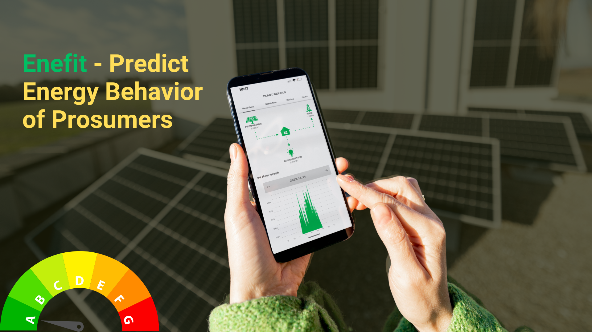

# Enefit - Predict Energy Behavior of Prosumers

## Descripción
Este proyecto tiene como objetivo predecir el comportamiento energético de los prosumidores para reducir los costos de desequilibrio energético utilizando técnicas de series temporales y AutoML en Azure Machine Learning.

La competencia aborda el problema del desequilibrio energético, donde la energía esperada que se utiliza no se alinea con la energía realmente utilizada o producida. Los prosumidores, que consumen y generan energía, contribuyen significativamente a este desequilibrio. Resolver este problema puede reducir costos operativos, mejorar la estabilidad de la red y fomentar el uso de energía renovable.

## Participantes
    Jordan Stiven Giraldo

## Estructura del Proyecto

team_energy_times/
|── README.md
|── .gitignore
├── data/
│   ├── raw/                      
│   └── example_test_files/      
├── notebooks/
│   ├── data_exploration.ipynb    
│   ├── model_training.ipynb      
│   └── model_evaluation.ipynb    
├── scripts/
│   ├── data_preparation.py       
│   ├── train_model.py            
│   └── evaluate_model.py         
├── pipelines/
│   ├── pipeline_definition.py
│   └── pipeline_steps/
│       ├── step1_preprocessing.py
│       ├── step2_training.py     
│       └── step3_evaluation.py   
├── mlflow/
│   ├── conda.yaml
│   ├── MLproject
│   └── run_experiment.py
├── results/
│   └── evaluation_metrics.json
├── report/
│   └── final_report.md           
├── presentation/
│   └── final_presentation.pptx   
└── demo/
   └── demo_video.md              

## Configuración
1. Clonar el repositorio.
2. Configurar el entorno de conda: `conda env create -f mlflow/conda.yaml`
3. Iniciar el entorno: `conda activate azure_env`

## Ejecución
1. Preparación de datos: `python scripts/data_preparation.py`
2. Entrenamiento del modelo: `python scripts/train_model.py`
3. Evaluación del modelo: `python scripts/evaluate_model.py`

## Licencia
El código en este repositorio está disponible bajo la siguiente licencia:

Código fuente: Licencia MIT
Los datos utilizados en este proyecto están sujetos a los términos de uso de la competencia. Se aplican las siguientes condiciones:

Datos del concurso: Los datos del concurso se utilizan bajo la licencia Creative Commons CC BY-NC-SA 4.0.

## Citación

Enefit - Predecir el comportamiento energético de los prosumidores, patrocinada por Eesti Energia AS.Kaggle
Enefit - Predict Energy Behavior of Prosumers. Kaggle. https://kaggle.com/competitions/predict-energy-behavior-of-prosumers